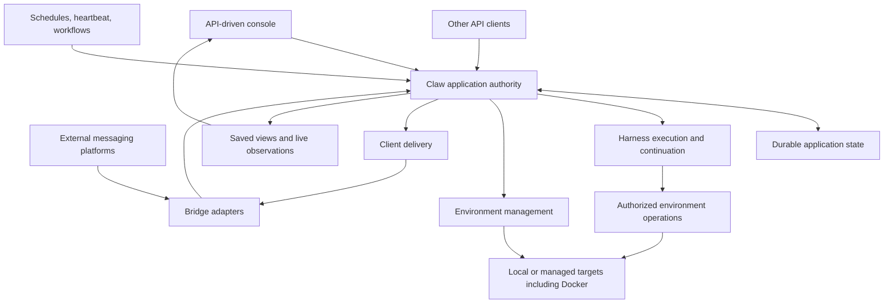

# Product and Architecture Overview

## Product Position

Claw is an operator-controlled, single-node agent application for ongoing work. People interact through a console, API clients, or messaging platforms; accepted work is owned by Claw rather than by the lifetime of a page, connection, or messaging adapter.

Persistent conversations, managed working environments, and unattended tasks share one application lifecycle. Harness supplies execution and continuation primitives; Claw defines its own durable admission, recovery, and API-first client boundary.

## Scope

| Area                 | Product responsibility                                                                                                     |
| -------------------- | -------------------------------------------------------------------------------------------------------------------------- |
| Conversations        | Create, continue, inspect, fork, and archive persistent work; expose pending decisions and actual outcomes                 |
| Agent composition    | Manage reusable behavior and resource selections, capture effective configuration, and explain unavailable dependencies    |
| Execution            | Accept work durably, advance histories without conflicting writers, control active work, and recover from interruption     |
| Workspaces           | Bind declared working data and execution permissions to work without treating a path as authority                          |
| Managed environments | Inspect and control backing targets, including Docker, independently of conversation and data retention                    |
| Background work      | Run delegated tasks, schedules, heartbeat, workflows, and bounded autonomous follow-up through the same execution boundary |
| Memory               | Maintain explicitly scoped reusable knowledge without substituting it for conversation checkpoints                         |
| Clients              | Provide a first-party API console and platform-neutral bridges for external messaging clients                              |

Lark, Discord, WhatsApp, and Telegram are adapter targets within the same client model. Listing a target defines an architectural extension point, not a claim of an implemented or feature-equivalent integration.

## Architecture

The boxes are responsibility boundaries, not a process topology or a set of required services. There is one Claw application authority on a node; adding a client or adapter does not add another execution owner.

## Ownership

Claw owns durable acceptance, resource configuration, Session and Run lifecycle, checkpoint selection, environment association, authorization, automation intent, and delivery records. Harness owns the agent loop, tool execution primitives, portable Thread continuation, and its native waiting boundaries. Environment providers own operations against their targets. A bridge owns platform transport and representation, not permission to bypass Claw admission.

The console provides management and conversation views over the application API. It does not read storage directly, construct an agent, decide that a Run completed from a disconnected stream, or become necessary for background progress.

## End-to-End Work Path

1. An authorized source submits work to an existing conversation or requests a new one.
2. Claw resolves scope, detects a repeated request, captures effective configuration, and durably accepts the input.
3. Execution waits for the right to advance the selected Thread and for its declared environment to be usable.
4. Harness executes against the selected continuation with fresh execution authority. Claw records pending decisions and observable progress.
5. Claw publishes a complete continuation and commits the work outcome. Output delivery is tracked independently.
6. A later client reconnects to saved application state; a later Run continues the saved Thread rather than reconstructing it from rendered messages.

[Execution](03-execution-lifecycle.md), [recovery](04-persistence-and-recovery.md), and [bridges](07-bridges-and-clients.md) own the detailed completion boundaries.

## Non-Goals

Claw does not define organization tenancy, billing, cross-node scheduling, a fleet control plane, a general Docker administration product, or unrestricted remote access to the server machine. Importing configuration or saved state requires an explicit compatibility contract. The console is not the public documentation site.

The design does not require every integration to arrive in one delivery. A partially implemented product must report unavailable capabilities rather than simulate them; implementation sequencing is not part of this specification.
