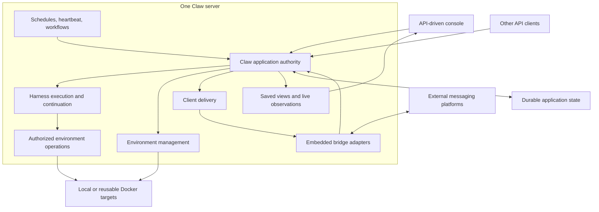

# Product and Architecture Overview

## Product Position

Claw is an operator-controlled, single-node agent application for ongoing work. People interact through a console, API clients, or messaging platforms; accepted work is owned by Claw rather than by the lifetime of a page, connection, or messaging adapter.

Persistent conversations, managed working environments, and unattended tasks share one application lifecycle. Harness supplies execution and continuation primitives; Claw defines its own durable admission, recovery, and API-first client boundary.

## Scope

| Area                 | Product responsibility                                                                                                     |
| -------------------- | -------------------------------------------------------------------------------------------------------------------------- |
| Conversations        | Create, continue, inspect, fork, and archive persistent work; expose pending decisions and actual outcomes                 |
| Agent composition    | Manage reusable behavior and resource selections, capture effective configuration, and explain unavailable dependencies    |
| Execution            | Accept work durably, advance histories without conflicting writers, control active work, and recover from interruption     |
| Workspace            | Share one Instance working directory across Threads through authorized execution environments                              |
| Managed environments | Inspect and control backing targets, including Docker, independently of conversation and data retention                    |
| Background work      | Run delegated tasks, schedules, heartbeat, workflows, and bounded autonomous follow-up through the same execution boundary |
| Memory               | Maintain Global and Thread-private file memory with bounded background organization                                        |
| Clients              | Provide a first-party API console and platform-neutral bridges for external messaging clients                              |

Lark, Discord, WhatsApp, and Telegram are adapter targets within the same client model. Listing a target defines an architectural extension point, not a claim of an implemented or feature-equivalent integration.

## Architecture

Claw deploys as one server process. API serving, console assets, bridge connections, automation, execution coordination, and environment management share that server's lifecycle. Bridges are internal adapters, not separately deployed services calling back into Claw over a private API. Their component boundaries do not introduce another execution owner.

The server starts enabled adapters after application recovery is ready for admission and stops ingress before draining or reconciling accepted work on shutdown. An individual adapter's disconnection is visible without stopping unrelated conversations or the console. Managed execution containers are separate resources, not additional Claw servers; their reuse and retention follow [environment management](05-workspaces-and-environments.md).

## Ownership

Claw owns durable acceptance, resource configuration, Channel bindings, Thread and Run lifecycle, checkpoint selection, environment association, authorization, automation intent, Inbox attention, worker ownership, and delivery records. Harness owns the agent loop, tool execution primitives, portable Thread continuation, and its native waiting boundaries. Environment providers own operations against their targets. A bridge owns platform transport and representation, not permission to bypass Claw admission.

The Instance selects either per-Channel routing or [One Thread mode](10-one-thread-mode.md) at startup. Per-Channel bindings route directly to Threads; One Thread mode uses a canonical Main Thread, a durable Inbox, and flat persistent owned Worker Threads. There is no Session or Project layer. All Threads use one Instance workspace, selected from the configured folder or startup working directory. Global memory is shared, while each Thread has its own private file memory. Shared working files are not Thread-private storage.

The console provides management and conversation views over the application API. It does not read storage directly, construct an agent, decide that a Run completed from a disconnected stream, or become necessary for background progress.

## End-to-End Work Path

1. An authorized source submits work to an existing conversation or requests a new one.
2. Claw resolves scope and reconciles request identity. Direct conversation messages join pending work or steer active work; an idle Thread receives a new Run with a captured composition. A bridge authorizes and filters before admission. In One Thread mode it retains eligible messages in the Inbox and requests Main attention instead of directly steering message bodies.
3. Execution waits for the right to advance the selected Thread and for its declared environment to be usable.
4. Harness executes against the selected continuation with fresh execution authority. Claw records pending decisions and observable progress.
5. Claw publishes a complete continuation and commits the work outcome. Output delivery is tracked independently.
6. A later client reconnects to saved application state; a later Run continues the saved Thread rather than reconstructing it from rendered messages. In One Thread mode, startup and Main Run settlement also check durable actionable backlog and admit eligible successor work; a lost notification or apparent model completion cannot strand pending Inbox items.

[Execution](03-execution-lifecycle.md), [recovery](04-persistence-and-recovery.md), and [bridges](07-bridges-and-clients.md) own the detailed completion boundaries.

## Non-Goals

Claw does not define organization tenancy, billing, cross-node scheduling, a fleet control plane, a general Docker administration product, or unrestricted remote access to the server machine. Importing configuration or saved state requires an explicit compatibility contract. The console is not the public documentation site.

The design does not require every integration to arrive in one delivery. A partially implemented product must report unavailable capabilities rather than simulate them; implementation sequencing is not part of this specification.
