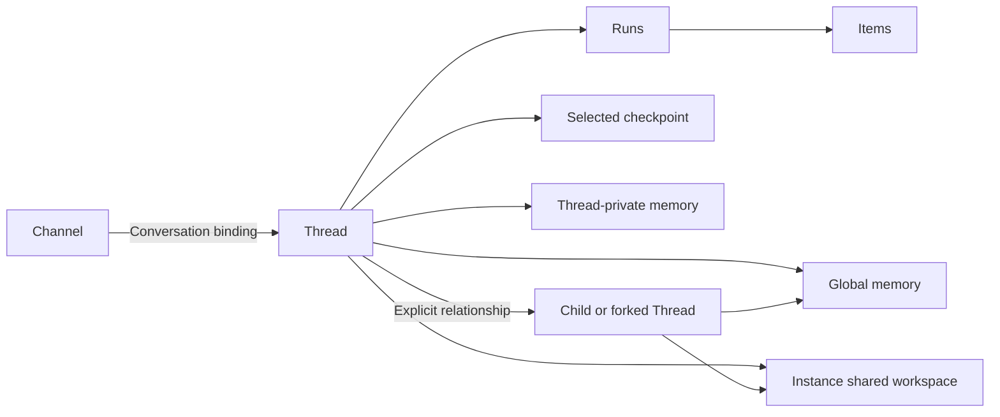

# Domain Model and Ownership

## Design Position

This document owns the shared vocabulary. Identities distinguish independent lifecycles; possession of an identifier does not grant access. These are conceptual relationships, not database entities or serialized schemas.

## Core Concepts

| Concept              | Meaning                                                                                                 | Authority                                                   |
| -------------------- | ------------------------------------------------------------------------------------------------------- | ----------------------------------------------------------- |
| Instance             | One operator-controlled Claw application and its durable operational context                            | Claw operator                                               |
| Channel              | One external conversation scope qualified by platform and connection                                    | Platform identity, Claw routing policy                      |
| Thread               | One independently advancing agent history, selected continuation, and private memory identity           | Harness history identity, Claw persistence and selection    |
| Run                  | One execution lifecycle advancing exactly one Thread, possibly incorporating several inputs             | Claw                                                        |
| Accepted input       | One retained submission with its own origin, identity, routing, and consumption disposition             | Claw                                                        |
| Item                 | A semantic presentation unit within a Run, such as a message, tool activity, decision, or error         | Claw projection of execution observations                   |
| Profile              | A reusable definition of agent behavior and default resource selections                                 | Claw configuration                                          |
| Captured composition | The effective, fixed configuration selected for an accepted Run                                         | Claw                                                        |
| Workspace binding    | The Instance's shared working directory exposed through a selected environment and permitted operations | Claw policy and selection                                   |
| Managed target       | An execution environment resource whose lifetime is managed separately from a Run                       | Environment management                                      |
| Checkpoint           | A complete saved continuation and the references needed to load it                                      | Harness supplies state; Claw selects the durable checkpoint |
| Pending decision     | A specific unanswered execution request requiring authorized human or external input                    | Claw, constrained by the corresponding Harness continuation |
| Conversation binding | A direct mapping from a Channel to a Thread, with participant and delivery policy                       | Bridge policy within Claw                                   |
| Delivery             | A separately tracked attempt to present a saved result or decision to an authorized destination         | Claw delivery policy and platform adapter                   |

[Automation](08-automation.md) owns schedules, heartbeat occurrences, workflows, and autonomous follow-up. [Memory](09-memory.md) owns Global and Thread-private reusable knowledge. Neither creates a competing conversation or execution model.

## Conversation Relationships

Claw has no Session or Project entity. A Channel routes directly to its bound Thread. A room, direct chat, or platform reply thread can define a Channel according to the adapter's routing semantics. A binding maps one Channel to one current Thread; sharing one Thread across several Channels requires an explicit sharing decision. Console, API, and automation work can create Threads without a Channel.

An accepted conversation input is not synonymous with a Run. Several messages can join or steer one Run; a receipt identifies the input and its current Run association without claiming that the agent has consumed it. [Execution](03-execution-lifecycle.md) owns routing and reconciliation. A Run belongs to exactly one Thread.

Resuming continues a Thread. Independently advancing children have distinct Thread identities and recorded parent relationships. Forking creates a new Thread from an identified checkpoint and leaves the source unchanged. Forking history does not copy private memory, credentials, pending work, delivery destinations, or backing containers. New Threads start with their own empty private memory and can use current Global memory. They see the same Instance workspace, not a cloned filesystem, under explicitly selected current authority.

Claw keeps its work identity distinct from a process-local Harness execution. A Run can span preparation and a persisted wait before completing; answering that wait can start another Harness execution without creating a different Claw Run. A new request to recover an interrupted Run creates new work with a reference to the interrupted source, not a rewrite of the source outcome.

## Independent State Boundaries

- Thread configuration selects future behavior; the selected checkpoint carries continuation, not configuration authority.
- The captured composition describes intended behavior for a Run; it is not a snapshot of all external files or remote services.
- A managed target can stop while its durable working data and owning Thread remain retained.
- A Run can finish while its result delivery is pending or failed.
- A Channel can disconnect without ending a Thread or cancelling work.
- A saved Item is a view of execution, not a resumable agent state.

The Instance uses one shared workspace rooted at its startup directory or configured folder. Threads do not select Projects or independent workspace roots. Separate histories and private memory do not imply filesystem isolation: working files and Global memory are deliberately shared, while Thread-private memory is bound only to its owner. [Environment management](05-workspaces-and-environments.md) and [memory](09-memory.md) own those distinct data boundaries.

## Sources and Authority

Each accepted input retains its origin: direct caller, bridge event, automation occurrence, or delegated work. A source records why work was requested; Claw policy decides what it may do. External account, conversation, message, and user identities stay qualified by their connection and platform scope. Equal display names do not identify the same person or authorize shared history.

A conversation binding routes work; it does not itself authorize every participant in an external room. A Profile selects behavior; it does not expand the caller's permissions. The [access contract](06-api-console-and-access.md) owns those checks.

## Invariants

1. Channel, Thread, Run, and managed target identities are not interchangeable.
2. Exactly one execution owner can advance a given Thread at a time, including across persisted waits.
3. History, execution configuration, workspace lifecycle, memory ownership, and output delivery have separate authorities.
4. A child or fork cannot overwrite its parent's continuation or inherit authority merely by copying history.
5. All ingress paths retain enough origin information to explain accepted work and to reconcile repeated submission.
