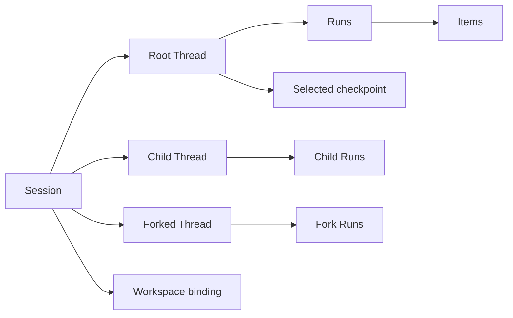

# Domain Model and Ownership

## Design Position

This document owns the shared vocabulary. Identities distinguish independent lifecycles; possession of an identifier does not grant access. These are conceptual relationships, not database entities or serialized schemas.

## Core Concepts

| Concept              | Meaning                                                                                          | Authority                                                   |
| -------------------- | ------------------------------------------------------------------------------------------------ | ----------------------------------------------------------- |
| Instance             | One operator-controlled Claw application and its durable operational context                     | Claw operator                                               |
| Session              | One persistent work context grouping related conversation histories, working context, and policy | Claw                                                        |
| Thread               | One independently advancing agent history and selected continuation                              | Harness identity, Claw persistence and selection            |
| Run                  | One accepted unit of work advancing exactly one Thread                                           | Claw                                                        |
| Item                 | A semantic presentation unit within a Run, such as a message, tool activity, decision, or error  | Claw projection of execution observations                   |
| Profile              | A reusable definition of agent behavior and default resource selections                          | Claw configuration                                          |
| Captured composition | The effective, fixed configuration selected for an accepted Run                                  | Claw                                                        |
| Workspace binding    | The declared working locations and permitted operations selected for work                        | Claw policy and selection                                   |
| Managed target       | An execution environment resource whose lifetime is managed separately from a Run                | Environment management                                      |
| Checkpoint           | A complete saved continuation and the references needed to load it                               | Harness supplies state; Claw selects the durable checkpoint |
| Pending decision     | A specific unanswered execution request requiring authorized human or external input             | Claw, constrained by the corresponding Harness continuation |
| Conversation binding | A mapping from an external conversation scope to a Claw Session and Thread                       | Bridge policy within Claw                                   |
| Delivery             | A separately tracked attempt to present a saved result or decision to an authorized destination  | Claw delivery policy and platform adapter                   |

[Automation](08-automation.md) owns schedules, heartbeat occurrences, workflows, and autonomous follow-up. [Memory](09-memory.md) owns reusable knowledge. Neither creates a competing conversation or execution model.

## Conversation Relationships

A new Session starts with a root Thread. Independently advancing children and forks have distinct Thread identities in that Session. A Thread belongs to exactly one Session; a Run belongs to exactly one Thread. A user can create another Session for unrelated work without moving an existing history between scopes.

Resuming continues a Thread. Forking creates a new Thread from an identified checkpoint and leaves the source unchanged. Forking history does not clone working files, credentials, pending work, delivery destinations, or backing containers. The new Thread receives explicitly selected current authority.

Claw keeps its work identity distinct from a process-local Harness execution. A Run can span preparation and a persisted wait before completing; answering that wait can start another Harness execution without creating a different Claw Run. A new request to recover an interrupted Run creates new work with a reference to the interrupted source, not a rewrite of the source outcome.

## Independent State Boundaries

- Session metadata and defaults can change without changing historical Runs.
- Thread configuration selects future behavior; the selected checkpoint carries continuation, not configuration authority.
- The captured composition describes intended behavior for a Run; it is not a snapshot of all external files or remote services.
- A managed target can stop while its durable working data and Session remain retained.
- A Run can finish while its result delivery is pending or failed.
- A channel can disconnect without ending a Session or cancelling work.
- A saved Item is a view of execution, not a resumable agent state.

There is no organization or project hierarchy required above Session. A workspace names a working context, not a tenant or a duplicate conversation catalog. Shared files and shared memory require explicit selection; separate Threads do not imply filesystem isolation.

## Sources and Authority

Each accepted input retains its origin: direct caller, bridge event, automation occurrence, or delegated work. A source records why work was requested; Claw policy decides what it may do. External account, conversation, message, and user identities stay qualified by their connection and platform scope. Equal display names do not identify the same person or authorize shared history.

A conversation binding routes work; it does not itself authorize every participant in an external room. A Profile selects behavior; it does not expand the caller's permissions. The [access contract](06-api-console-and-access.md) owns those checks.

## Invariants

1. Session, Thread, Run, and external conversation identities are not interchangeable.
2. Exactly one execution owner can advance a given Thread at a time, including across persisted waits.
3. History, execution configuration, workspace lifecycle, and output delivery have separate authorities.
4. A child or fork cannot overwrite its parent's continuation or inherit authority merely by copying history.
5. All ingress paths retain enough origin information to explain accepted work and to reconcile repeated submission.
