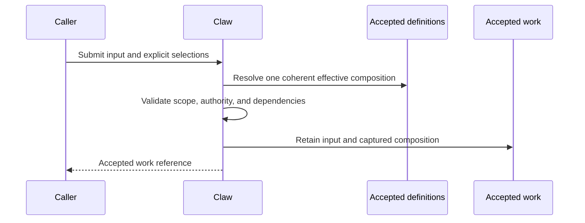

# Configuration and Run Composition

## Design Position

Claw owns the configuration consumed by its API-driven product. A Profile is a reusable application definition, not an executable runtime object. The backend validates and accepts configuration; the console edits and selects it through the same application boundary used by other authorized clients.

Mutable defaults and fixed Run compositions have separate lifecycles. Accepted application state is the configuration authority. Importing or exporting configuration is a management operation, not a second authority competing with that state.

## Definition Boundaries

A Profile expresses intended agent behavior and selections for models, instructions, capabilities, tools, skills, delegation, and execution environments. Shared resources retain their own identity and lifecycle. Claw uses Harness public concepts where they already own execution semantics rather than inventing parallel model, tool, or capability types.

Definition, availability, authorization, and readiness are separate:

- A resource can be known without being enabled for this Instance.
- A valid definition can refer to a service that is temporarily unavailable.
- A caller may read a resource without being allowed to use or change it.
- Saving credentials or a connection does not prove successful connectivity.

Provider credentials and privileged integration configuration remain protected backend state. Captured compositions retain the necessary references and provenance, not reusable secret values or live clients.

## Defaults and Effective Behavior

Instance and Profile defaults initialize Thread selections. Changing a default affects newly resolved work; it does not silently reset an existing Thread's explicit selections. Applying changed defaults to an existing Thread is an explicit operation.

The Instance selects its exclusive conversation mode at startup under [One Thread mode](10-one-thread-mode.md#instance-mode-and-lifetime). This is an Instance-level routing and authority choice, not a per-Channel, Profile, or model-selected override. Main identity, worker ownership, and automatic-processing pause are durable application state, not prompt conventions.

The Instance owns its one workspace root and the memory/automatic-organization settings. Thread or Profile selections cannot introduce another workspace root or another Thread's private memory. A memory-enabled ordinary Run captures Global and its own private scope according to [memory](09-memory.md); environment selection exposes the [shared workspace](05-workspaces-and-environments.md), not a Project selection.

Claw distinguishes editing a shared resource from selecting a different resource. Work that resolves that shared resource after an accepted edit can use the new content; work already accepted retains its captured content. Historical Runs remain explainable even if a resource is renamed or retired.

A submitted configuration change checks the version the editor actually read. Conflicting edits fail visibly without discarding local input. A combined configuration change and work submission either accepts the intended combination or rejects it; it never executes against an accidental mixture.

## Capture Flow

A Run's captured composition is fixed when that Run is durably admitted, before queueing or environment preparation. Ordinary messages that join or steer an existing Run use its captured composition; they do not capture a second configuration or apply edited defaults to active work. A request combining input with a different composition must explicitly request a separate Run or be rejected, never disguised as a configuration-changing steer. Waiting in a queue does not silently adopt later Profile edits. Selecting the latest permitted Thread checkpoint at execution start is a separate operation owned by [execution](03-execution-lifecycle.md); configuration capture must not freeze a stale history for queued work.

Current permission and credential validity are checked again when work uses them. A captured definition is not a permanent authorization grant. If its required component becomes unavailable or disallowed, Claw reports the blockage or failure instead of substituting a different model, tool, or environment.

## Change and Retirement

Retiring a resource prevents new selection according to its policy while preserving historical descriptions. It does not rewrite accepted compositions. Destructive removal must not leave retained checkpoints or accepted work silently pointing to missing dependencies.

Provider implementations are trusted installation choices. A Profile, imported document, chat message, or bridge payload cannot register executable code or expand the installed provider catalog.

## Invariants

1. Every accepted Run has an inspectable effective composition independent of later edits.
2. Mutable defaults, shared resource content, and captured execution behavior remain distinguishable.
3. Configuration changes never replace or reset Thread history implicitly.
4. All clients use one validation and publication boundary; saved configuration and current readiness are separate facts.
