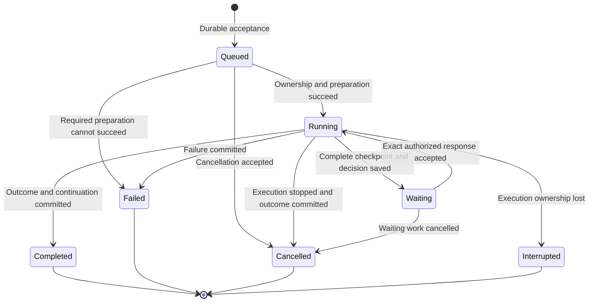
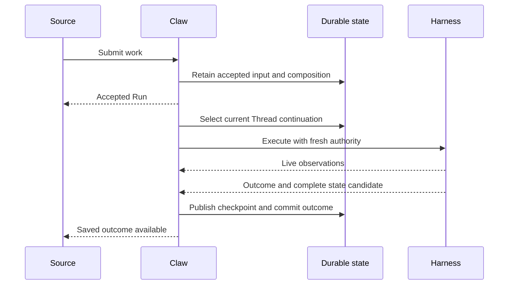

# Execution and Interaction Lifecycle

## Design Position

Claw owns work acceptance and durable outcomes. Harness owns process-local agent execution and produces continuation candidates. An API response, observed model output, checkpoint publication, and external reply are different facts.

## Admission and Ordering

All work sources use the same admission rules. Before acknowledging acceptance, Claw retains the input, origin, destination Thread, captured composition, and identity needed to reconcile retries. Required input attachments must be retained or explicitly unavailable; a short-lived external download link alone does not satisfy acceptance.

A repeat of the same identified request returns the original accepted work. Reusing that identity with different content or scope is a conflict. A timeout does not establish rejection: the caller first checks whether the original work exists.

Only one Run owns advancement of a Thread at a time. Other accepted Runs remain queued in an observable order. A waiting Run retains its position; later prompts do not bypass an unanswered decision. Independent Threads can execute concurrently, subject to their declared access to shared resources.

At execution start, Claw selects the Thread's current complete checkpoint under exclusive advancement ownership. It uses the composition fixed at admission, verifies current authority, and prepares the required environment. This allows queued work to follow committed conversation progress without changing its accepted behavior.

## Work Lifecycle

The names below describe observable phases, not a wire-format enum.

Queued work can expose a preparation or dependency blockage without pretending to be running. Preparation is part of the accepted Run and cannot become an invisible competing execution. A cancellation during preparation follows the same ownership and completion checks as cancellation during execution.

An interrupted Run is retained with its last known progress and selected checkpoint. Recovery creates a new Run on the same Thread with an explicit source reference after [reconciliation](04-persistence-and-recovery.md); it does not resurrect the old Run or silently replay uncertain side effects.

## Normal Execution Flow

A Run is not reported as successfully completed until its required result and continuation boundary are durable. Failure to deliver a notification afterwards cannot change that outcome. A failed or cancelled execution can still leave a valid checkpoint or changed external data; Claw reports those facts rather than implying rollback.

## Human Decisions

A Pending decision names the exact waiting work, requested action, and continuation to which an answer applies. Claw saves the complete waiting boundary before presenting it as resumable. A question and a tool approval are distinct requests; an arbitrary new chat message is not an answer to either.

The first valid response from an authorized client is accepted against the still-current decision. A repeated identical response can be recognized; stale or conflicting answers cannot resume work twice. Policy is checked again before continuation. Rejecting an action is not silently converted into approval through a later client or automatic retry.

Console and bridge clients may answer the same decision only when their permissions allow it. If a platform cannot express a required interaction safely, work remains waiting and the user is directed to an authorized capable surface.

## Steering and Cancellation

Steering is an explicit request targeting active work, not an implicit interpretation of every later message. Claw distinguishes durable receipt, delivery to an active execution, and incorporation into a saved continuation. If delivery races with completion, it records that the input was not applied or remains uncertain; it does not silently turn the input into new work.

Cancellation records intent before reporting a final outcome. Queued work can be cancelled without execution. Active work is cancelled only after the executor has stopped or its loss has been reconciled. If completion wins the race, the completed outcome remains authoritative. Cancellation does not undo external actions already performed.

## Delegation

Delegated work uses a distinct Thread and Run with a recorded parent relationship and explicitly bounded authority. Inline execution does not create a new independent work owner; background execution does. Child progress and completion are visible without merging their history into the parent Thread.

A parent that waits for a child can continue only from the child's saved outcome or an explicit failure condition, not merely a delegation receipt. Child-result delivery and parent continuation are tracked separately so a retry cannot append the result twice. Stopping a parent does not prove every child stopped; the requested propagation policy and actual child outcomes remain visible.

## Invariants

1. Accepted input survives client disconnect and is never silently discarded on restart.
2. No two Runs publish competing continuation heads for the same Thread.
3. A waiting decision cannot be bypassed by another client, later prompt, or duplicate callback.
4. Saved terminal outcomes are not rewritten by notification failures or stale executors.
5. Unknown effects remain explicit until reconciled; retry is not a promise of exactly-once external execution.
