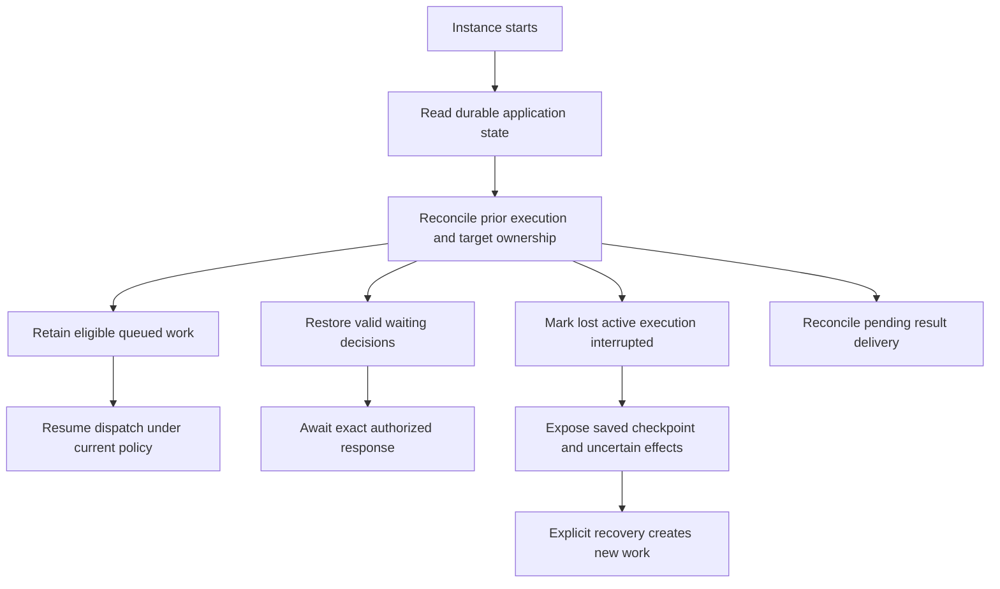

# Persistence, Recovery, and Retention

## Design Position

Claw separates small mutable application heads, immutable captured values and continuation checkpoints, independently owned working data, and disposable live observations. This contract does not select a database engine, storage layout, or persistence library.

Accepted work and pending delivery are durable application facts. External clients and unattended automation cannot depend on a browser or process-local receipt remaining alive.

## Durable Truth

| State                           | Durability responsibility                                                                                                                     |
| ------------------------------- | --------------------------------------------------------------------------------------------------------------------------------------------- |
| Definitions and selection heads | Preserve accepted resource content, current defaults, and versions needed to detect conflicting edits                                         |
| Threads                         | Preserve identity, relationships, configuration selections, and the selected complete continuation                                            |
| Accepted work                   | Preserve each input's identity, origin, ordering, Run association and consumption disposition, plus Run composition, decisions, and outcome   |
| Immutable values                | Retain captured compositions, complete Harness continuation, and referenced input/output artifacts                                            |
| Environment associations        | Retain intended selection and last confirmed provider state without treating cached liveness as current truth                                 |
| Bridge and automation state     | Retain conversation mappings, accepted event identities, occurrences, result destinations, and unresolved delivery                            |
| Working files                   | Preserve the Instance's shared workspace independently of Thread and container removal                                                        |
| File memory                     | Preserve Global and Thread-private files, scope-keyed cursors, and organization state independently of workspace and conversation checkpoints |
| Live observations               | May be lost; do not decide acceptance, completion, permission, or recoverability                                                              |

Native runtime objects, live credentials, connection handles, process-local locks, stream subscribers, and shell observation handles are not restorable execution authority. Saved references must be validated before use.

## Checkpoint Publication

Claw retains complete Harness continuation, including referenced content required to load it. Rendered Items, summarized history, partial streams, and usage displays cannot substitute for a checkpoint.

Publishing an immutable checkpoint and selecting it as the Thread's current continuation form one observable completion boundary: readers never select a partial value. The selected value must belong to that Thread and to the execution owner still permitted to advance it. An unselected candidate is not evidence that history advanced.

For waiting work, the saved pending request and selected continuation must agree. For completed work, the committed outcome identifies the checkpoint it published. Historical configuration remains associated with the work that actually used it.

Environment-state publication, external effects, and checkpoint selection remain separate. A failed checkpoint write does not imply that a command, file write, container start, or message send did not happen.

## Restart Flow

Dispatch resumes only after Claw has excluded an old writer from publishing or continuing conflicting work. A saved running marker is not proof of liveness, and an empty in-memory registry is not proof that an external process stopped. If ownership cannot be established, affected work remains blocked and visible.

Pending, held, steered, incorporated, unapplied, and uncertain input dispositions survive restart independently of live Harness handles. A known-undelivered input remains available for the routing rules in [execution](03-execution-lifecycle.md); a message that may already have been consumed is not automatically replayed. Reconnecting adapters reconcile saved event dispositions before admission resumes, including events ignored by the group filter.

Already accepted work that demonstrably never started can proceed after current authority and readiness checks. Work that may have executed is not automatically replayed from its initial input. Complete waiting checkpoints can restore their decision without inventing a new question or reusing a stale answer.

## Failure Semantics

| Failure boundary                               | Observable recovery behavior                                                                   |
| ---------------------------------------------- | ---------------------------------------------------------------------------------------------- |
| Before durable acceptance                      | No accepted-work promise; retry uses the original request identity to check for a raced commit |
| After acceptance, before dispatch              | Accepted work remains discoverable and can wait, proceed, or be cancelled                      |
| During execution, before a complete checkpoint | Preserve last committed history and mark uncommitted progress or effects as uncertain          |
| During checkpoint publication                  | Keep the prior selected continuation until the new complete boundary is safely selected        |
| After outcome commit, before client reply      | Return the saved outcome and reconcile delivery; do not execute again to reproduce a reply     |
| Missing or incompatible saved content          | Keep retained history inspectable where possible and block continuation explicitly             |

A newer Harness version, changed Profile, or lost environment is not permission to reset a conversation to empty state. Compatibility failures identify the unusable component or saved boundary for operator action.

## Retention and Removal

Archiving affects visibility and new-work admission; it does not delete history or stop external resources by implication. Deleting conversation records, purging artifacts, stopping a target, and deleting working data are different operations.

Retention cannot silently remove content referenced by retained continuations, waiting decisions, accepted work, or unresolved delivery. Shared data remains until its owning scope permits removal. Explicit deletion reports the data and dependencies affected and cannot leave active work with a valid-looking but broken continuation.

A recoverable backup must cover a coherent set of application heads and the values they reference. Memory files are part of the recoverable application data set; ordinary conversation checkpoints alone do not include them. Workspace data and external service state may require separate retention; copying only application records does not promise restoration of those resources or reverse external effects.

## Invariants

1. Durable application truth, complete continuation, working data, and live observations are not interchangeable.
2. Recovery restores state, not old process authority or unverified liveness.
3. Publication cannot select partial, incompatible, wrong-Thread, or stale-writer continuation.
4. A saved result can be delivered again without rerunning the agent.
