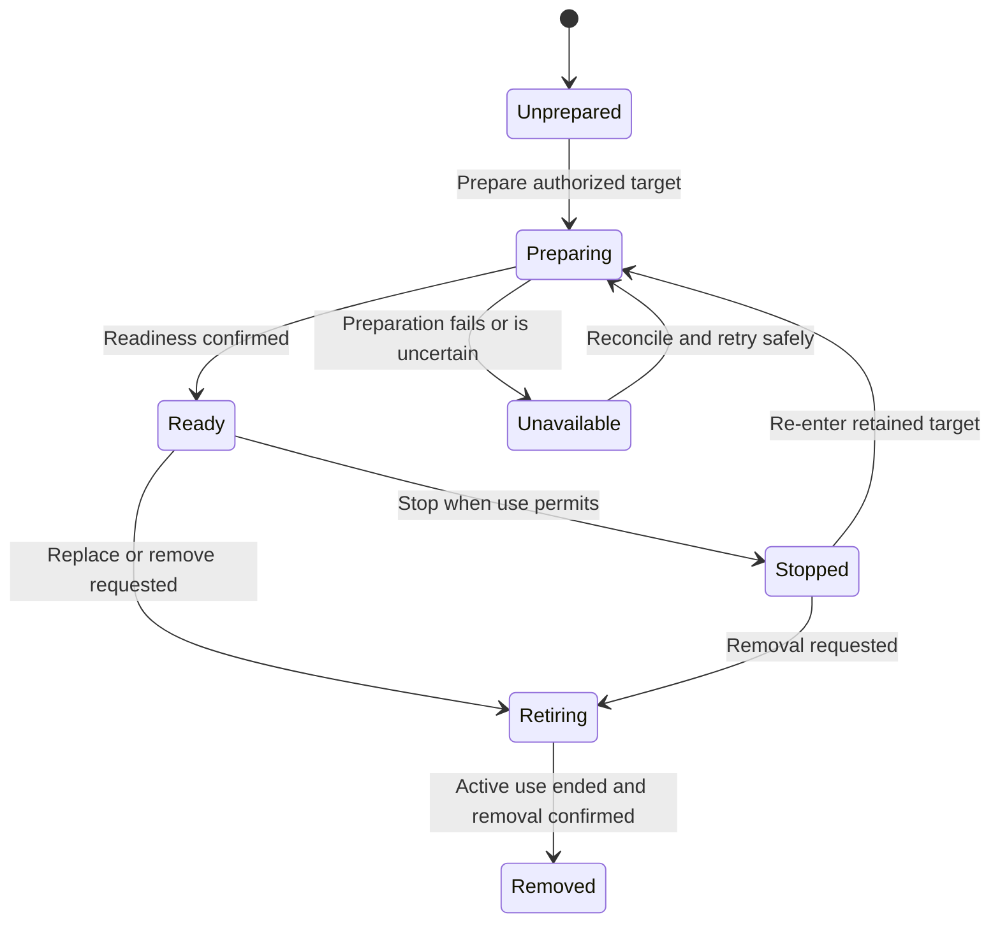

# Workspaces and Environment Management

## Design Position

A workspace binding describes where work can read, write, and execute. An environment supplies those operations. A managed target supplies the backing resource and its independent lifecycle. Docker is a supported management target, not the definition of workspace or conversation identity.

Running the Claw application itself in Docker is a separate deployment choice. It neither grants agents access to the server container nor implies that every Run receives its own container.

## Responsibility Boundary

| Responsibility                                                     | Owner                                                   |
| ------------------------------------------------------------------ | ------------------------------------------------------- |
| Select the shared workspace root and permitted operations          | Instance configuration and Claw policy                  |
| Capture the selection for accepted work                            | Claw composition and admission                          |
| Inspect, prepare, start, stop, replace, and retire managed targets | Claw environment management using the selected provider |
| File, command, and other admitted operations within a Run          | Harness environment boundary and provider               |
| Backing-resource behavior and observed state                       | Provider                                                |
| Working-data retention and explicit destruction policy             | Declared data owner under Claw management policy        |

The management API is not an unrestricted Docker proxy. It operates on resources associated with the Instance and the caller's authorized scope. Availability of a provider or a running container grants no execution permission.

## Working Context

The Instance has one shared workspace directory. It uses the configured folder when supplied, otherwise the server's startup working directory. A relative configured folder resolves against that startup directory; the resolved root is fixed for the server lifetime and visible to users and agents. It is independent of the configuration directory and application data root. There is no Project catalog, per-Thread workspace root, or prompt-level override of this root.

All ordinary Threads use that same working data through their selected local or Docker environment, subject to admitted operations. Different containers can mount the same host directory; container-local paths need not equal the host path. Separate Thread histories, private memory, and container identities do not isolate shared working files. Concurrent Threads can affect each other's files; Thread execution serialization is not a workspace-wide lock or filesystem transaction.

Additional operational mounts, such as retained input attachments, have explicit identities, locations, operation sets, and owners; they do not create alternate workspace roots. Application state, credentials, and file-memory stores are not exposed through the ordinary shared workspace binding. The shared directory is not a container's disposable writable layer.

A path is an address in the selected environment, not proof of a local host path. Console file access follows the selected managed context and its permissions; it does not silently turn into native access to the Claw server. A bound directory is not automatically a sandbox, and Docker availability alone is not a guarantee of isolation.

Accepted work retains its captured workspace definition. Changes to mounts or execution policy affect later admissions, not a Run already using a different definition. Backing files remain mutable data unless an explicit snapshot was requested; capturing a composition does not freeze file contents.

## Management Lifecycle

These are management observations, not Run states or prescribed provider status strings. Management distinguishes a requested operation from a confirmed result. A timeout during creation or stop is an unknown outcome that must be inspected before issuing another potentially destructive operation.

Conversation work reuses a Thread-owned Docker target by default. Each Thread's binding mounts the Instance's shared workspace; sharing working data does not require one Instance-wide container. A target scoped to one Run is an explicit lifecycle choice, not a side effect of receiving a new message or using another client. Stop-on-idle and keep-available are retention policies over managed targets; neither deletes durable workspace data implicitly.

## Docker Reuse Contract

Management distinguishes three identities: the durable owner and workspace binding, its configuration generation, and the replaceable physical container. A generation describes the container-relevant configuration: image selection, execution identity, mount sources and destinations, access modes, working directory, and container execution settings. Model changes, message IDs, Run IDs, and observation timestamps do not by themselves create a new generation.

A compatible binding reuses its generation and container across Runs. Changing a container-relevant setting selects a new generation for work admitted with that definition. An active Run keeps its resolved generation, and previously queued work must still receive its captured definition. A replaced container can have a new physical ID within the same generation; losing a cached ID is not a reason to discard the binding or workspace data.

Preparation is serialized for the selected binding and generation. Management first inspects the known container, then reconciles the stable association if the cached ID is missing or stale, and creates a container only when no usable associated one exists. It verifies ownership, compatible configuration, running state, and readiness before use. A stopped compatible container is restarted. Unknown Docker outcomes block duplicate creation or removal until inspected; finding an unrelated container with a similar name does not authorize adopting or deleting it.

Closing a Run's environment access releases its use without deleting the reusable container. Idle retention stops a target only when no Run is using it and retains enough association to find and restart it. Server restart similarly reconciles retained targets instead of allocating a fresh container for every Thread continuation. Retention and new acquisition are serialized so an idle-stop decision cannot stop a newly acquired target.

Explicit replacement, missing containers, or unusable owned containers can require recreation after active use has ended. Managed persistent mounts survive according to their data policy; files in the container's writable layer, processes, and shell observation handles do not have that guarantee. Reusing a container preserves useful working state but is not an execution checkpoint or rollback mechanism. Docker lifecycle authority remains with the server's manager, not an agent tool or a mount of the server's Docker control socket.

## Prepare and Use Flow

1. Claw verifies the captured workspace selection and current authority for the work.
2. Management identifies a compatible associated target or prepares an authorized replacement.
3. Readiness and resource identity are confirmed before execution begins. An unknown target is not treated as ready.
4. Harness receives fresh operational access for that Run. Ordinary closing of that access releases the Run's use, not the target's durable data.
5. After work releases the target, management applies its retention policy and records the confirmed result.

Claw keeps a target associated with the correct owner across restart. Provider state is evidence to reconcile, not permission to attach to any container matching a name. A missing required Docker environment blocks work or produces an explicit failure; it never silently falls back to unrestricted host execution.

## Reconfiguration and Destruction

A target in use is not replaced under an active executor. A management change either waits for use to end or requests explicit interruption and observes its outcome. Queued work must still receive a target compatible with its own captured selection; reconfiguration does not rewrite queued work to match a convenient new container.

Environment replacement does not rewrite Thread history or reset the shared workspace. A forked Thread uses the same working directory, not a copied filesystem, while its managed target association is independent. Changing the Instance workspace root requires explicit server reconfiguration; it does not move files automatically. Retained queued work still requires its captured binding or an explicit blockage, never a silent switch to the new root.

Deleting a target, deleting its owning Thread, deleting private memory, and deleting the shared workspace require distinct authorization and visible impact. Thread or container cleanup cannot remove the Instance's workspace. Shared targets and mounts cannot be destroyed while another owner still depends on them. Cleanup failure is reported independently of a committed Run result.

## Invariants

1. Environment management authority is separate from agent file and command authority.
2. One Instance workspace is shared across Threads; target identity, current readiness, private memory, and retained working data have separate meanings.
3. An active Run never silently changes backing target or escalates to host execution.
4. Target cleanup cannot manufacture cancellation, erase retained history, or imply rollback of file changes.
