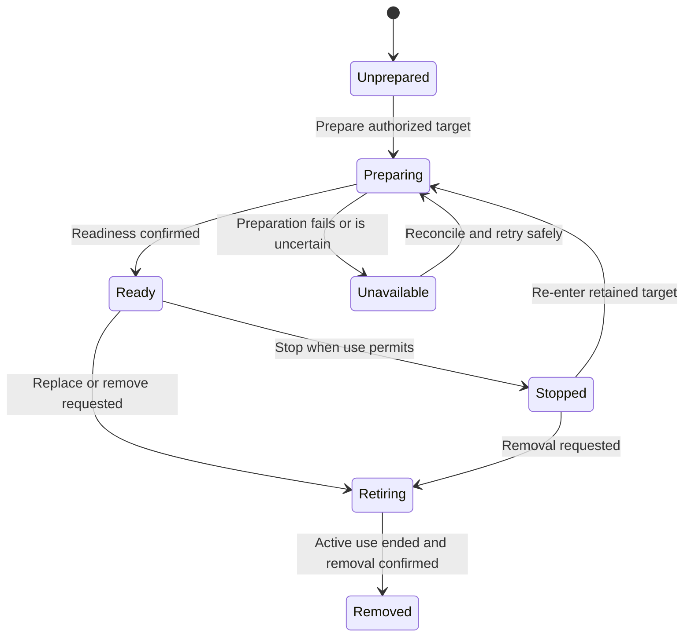

# Workspaces and Environment Management

## Design Position

A workspace binding describes where work can read, write, and execute. An environment supplies those operations. A managed target supplies the backing resource and its independent lifecycle. Docker is a supported management target, not the definition of workspace or conversation identity.

Running the Claw application itself in Docker is a separate deployment choice. It neither grants agents access to the server container nor implies that every Run receives its own container.

## Responsibility Boundary

| Responsibility                                                     | Owner                                                   |
| ------------------------------------------------------------------ | ------------------------------------------------------- |
| Select working context and permitted operations                    | Claw policy and Session or Thread configuration         |
| Capture the selection for accepted work                            | Claw composition and admission                          |
| Inspect, prepare, start, stop, replace, and retire managed targets | Claw environment management using the selected provider |
| File, command, and other admitted operations within a Run          | Harness environment boundary and provider               |
| Backing-resource behavior and observed state                       | Provider                                                |
| Working-data retention and explicit destruction policy             | Declared data owner under Claw management policy        |

The management API is not an unrestricted Docker proxy. It operates on resources associated with the Instance and the caller's authorized scope. Availability of a provider or a running container grants no execution permission.

## Working Context

A Session selects a default working context; individual Threads can have explicit selections. Multiple mounts can participate, but each has an unambiguous identity, location, operation set, and owner. The effective default working location is visible to both the user and the agent.

A path is an address in the selected environment, not proof of a local host path. Console file access follows the selected managed context and its permissions; it does not silently turn into native access to the Claw server. A bound directory is not automatically a sandbox, and Docker availability alone is not a guarantee of isolation.

Accepted work retains its captured workspace definition. Changes to mounts or execution policy affect later admissions, not a Run already using a different definition. Backing files remain mutable data unless an explicit snapshot was requested; capturing a composition does not freeze file contents.

## Management Lifecycle

These are management observations, not Run states or prescribed provider status strings. Management distinguishes a requested operation from a confirmed result. A timeout during creation or stop is an unknown outcome that must be inspected before issuing another potentially destructive operation.

A backing target can be reused across conversation Runs or scoped to one unit of work. Its declared ownership determines reuse and cleanup, not whether input came from the console or a particular messaging platform. Stop-on-idle and keep-available are retention policies over managed targets; neither deletes durable workspace data implicitly.

## Prepare and Use Flow

1. Claw verifies the captured workspace selection and current authority for the work.
2. Management identifies a compatible associated target or prepares an authorized replacement.
3. Readiness and resource identity are confirmed before execution begins. An unknown target is not treated as ready.
4. Harness receives fresh operational access for that Run. Ordinary closing of that access releases the Run's use, not the target's durable data.
5. After work releases the target, management applies its retention policy and records the confirmed result.

Claw keeps a target associated with the correct owner across restart. Provider state is evidence to reconcile, not permission to attach to any container matching a name. A missing required Docker environment blocks work or produces an explicit failure; it never silently falls back to unrestricted host execution.

## Reconfiguration and Destruction

A target in use is not replaced under an active executor. A management change either waits for use to end or requests explicit interruption and observes its outcome. Queued work must still receive a target compatible with its own captured selection; reconfiguration does not rewrite queued work to match a convenient new container.

Environment replacement does not rewrite Thread history. Preserving mounted data, copying data, and starting empty are materially different actions and must be explicit. A forked Thread does not receive a copied filesystem by virtue of having forked history.

Deleting a target, deleting its retained data, and deleting its associated Session require distinct authorization and visible impact. Shared targets and mounts cannot be destroyed while another owner still depends on them. Cleanup failure is reported independently of a committed Run result.

## Invariants

1. Environment management authority is separate from agent file and command authority.
2. Workspace selection, target identity, current readiness, and retained data have separate meanings.
3. An active Run never silently changes backing target or escalates to host execution.
4. Target cleanup cannot manufacture cancellation, erase retained history, or imply rollback of file changes.
