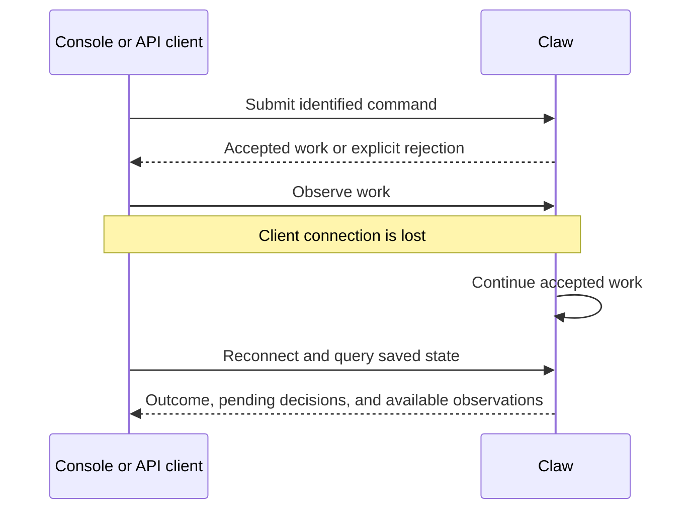

# Application API, Console, and Access

## Design Position

Claw exposes one application boundary for management, conversation, observation, and execution control. API handlers and embedded bridges invoke that authority within the same server; only external clients need a network API. The console is an API frontend over that boundary. It owns navigation, forms, local drafts, and presentation; the backend owns validation, authorization, accepted work, and saved outcomes.

This document defines operation semantics and trust boundaries, not endpoint paths, authentication protocols, frontend components, or generated client types.

## Application Surfaces

| Surface               | Observable responsibility                                                                                                 |
| --------------------- | ------------------------------------------------------------------------------------------------------------------------- |
| Definitions           | Inspect and change reusable resources, defaults, and current availability                                                 |
| Threads               | Create and navigate work, inspect history and relationships, continue or fork, and archive                                |
| Runs and decisions    | Submit messages with always-steer routing, inspect input disposition, cancel work, and answer authorized pending requests |
| Environments          | Inspect selected working contexts and perform authorized management operations                                            |
| Automation and memory | Manage background intent, inspect its resulting work, and access explicitly scoped knowledge                              |
| Bridges               | Manage connections and bindings; inspect event admission, delivery, and readiness independently                           |
| Operations            | Show Instance readiness, blocked work, recovery needs, and retained diagnostic evidence                                   |

Commands produce application outcomes or accepted-work references. Queries return authoritative saved views plus clearly identified live observations. A client must be able to distinguish accepted, running, waiting, interrupted, and completed work without inferring state from a transport connection.

## Access Boundary

The Instance is a trusted operator's application, not an organization tenancy system. Administration and participation are nevertheless different authorities. The operator controls reusable configuration, credentials, environment management, integrations, and grants. A delegated API client or external participant receives only the actions and scopes explicitly permitted for it.

Every application operation checks caller identity, target scope, action, and current policy. Being connected to a bridge or allowed to submit a prompt does not grant access to arbitrary Threads, stored artifacts, other users' conversations, resource editing, or Docker lifecycle operations. Tool approvals cannot exceed the authority of the approving caller or captured work.

Global memory and the Instance workspace are deliberately shared across Threads. Participation grants must account for information available to the agent through those surfaces; private Thread history and memory are not a promise of isolated working files. The [memory contract](09-memory.md) owns private-scope binding and disclosure, including shared-Thread participation.

Bindings and identifiers are routing information, not bearer authority. A configured credential is not proof that an external sender is trusted. Group membership, model-generated instructions, and imported workspace content cannot expand permissions.

Secrets remain backend-owned and are excluded from ordinary projections, captured compositions, browser persistence, bridge payloads, and diagnostics. Files and output fetched through a client are subject to the same scope checks as the conversation that exposes them. Retained content is rendered as untrusted content, not executed as console application code.

## Command and Reconnect Flow

Reconnect does not repeat a mutation automatically. If the original response was lost, the client reconciles the original request before offering a new submission. Concurrent edits and decisions retain their original preconditions; refreshing a view cannot silently change the version a form is overwriting.

Live observations can be incomplete. Clients reconcile with saved Run and Thread state on reconnect or a detected gap. A stream ending is not completion, and absence of live output is not proof of inactivity. Saved output and current work state remain usable without replaying every transient event.

## Console Behavior

The console presents Thread conversations, configuration, environment, bridge, automation, and memory views over the same product, without a Session or Project selector. Its observation-only memory view follows [memory](09-memory.md#completion-and-observation) rather than exposing maintenance Threads as ordinary chats. An execution view shows its source, captured composition, working context, pending decisions, outcome, and delivery status where applicable. Historical settings are distinguishable from next-Run defaults.

The conversation composer submits ordinary messages through [always-steer admission](03-execution-lifecycle.md#conversation-message-admission). It does not have to guess whether to start or steer from a stale liveness indicator. The view distinguishes receipt, held input, steering delivery, and incorporation; it does not label an accepted message as executed. Explicit Run controls remain separately targeted.

Client-side selection does not change backend routing. Switching a page neither cancels work nor redirects a bridge reply. Closing the last page has no effect on accepted work. Unsaved drafts remain drafts; they are not recovered or executed as if submitted.

A management action describes its scope and destructive impact. Busy, unavailable, unauthorized, and missing are distinct conditions. Unsupported operations remain explicit rather than creating fake successful state. Console access to working files follows [workspace authority](05-workspaces-and-environments.md), not an implicit server-wide file browser or terminal.

## Invariants

1. Every client uses the same authoritative command, validation, and permission boundary.
2. Client liveness is independent of Run ownership and application progress.
3. A browser cache or stream cannot overrule saved state or current authorization.
4. Error recovery preserves the distinction between retrying delivery and accepting new work.
