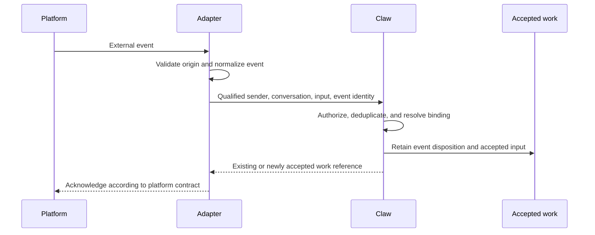

# Bridges and External Clients

## Design Position

A bridge connects an external communication system to Claw's application model. It normalizes platform events and presents results without owning a second Session store, scheduler, agent loop, or authorization policy.

Lark, Discord, WhatsApp, and Telegram are supported design targets. Platform-specific capabilities, transports, account rules, and message formats belong to their adapters; they are not assumed to be identical or fixed by this contract. Adding another client must not require a new Run lifecycle.

## Boundaries

| Concern                                                                       | Owner                                      |
| ----------------------------------------------------------------------------- | ------------------------------------------ |
| Connect, authenticate with the platform, receive events, and send messages    | Platform adapter                           |
| Normalize conversation, sender, message, attachment, and interaction meaning  | Platform adapter under the bridge contract |
| Authorize senders and resolve conversation bindings                           | Claw bridge policy                         |
| Deduplicate accepted input and admit work                                     | Claw application                           |
| Execute, wait, cancel, and recover                                            | Claw execution and Harness                 |
| Select permitted recipients and retain delivery intent                        | Claw delivery policy                       |
| Convert output to supported platform representations and report send outcomes | Platform adapter                           |

Connection readiness, ingress admission, agent progress, and egress health are separately inspectable. An outbound send failure does not make a completed Run fail; a live connection does not mean an incoming message was accepted.

## Connections and Conversation Bindings

A connection identifies one configured platform account or installation. External conversation and sender identities are qualified by that connection and their relevant platform scope. A room, direct chat, and reply thread can have different routing meaning; the adapter preserves those distinctions rather than flattening all events into one chat identifier.

A conversation binding selects a Session and Thread, allowed participants, triggering behavior, and permitted reply destinations. Policy determines whether an unbound eligible conversation creates a new Session, requires operator binding, or is rejected. None of those policies can route unknown input to an arbitrary existing conversation.

Independent external conversations are not merged merely because their participants have the same name or their text is similar. Binding several external conversations to one internal work context is an explicit sharing action with visible disclosure implications. It does not automatically subscribe every binding to every output.

Rebinding affects new events. Accepted work retains its origin and intended destination; delivery still checks current policy. Removing a binding or disabling a connection stops new admission according to policy, but does not imply cancellation of already accepted Runs. Pending replies whose destination is no longer authorized remain blocked or are explicitly discarded, never redirected silently.

## Ingress Flow

Transport acknowledgement is not a claim that an agent finished. An eligible event is not acknowledged as durably accepted until its retained disposition can be recovered. Repeated event delivery returns the prior disposition instead of creating another Run. A conflicting reuse of event identity is rejected.

The bridge distinguishes a request to execute, an explicit control action, a reply to a pending decision, and context-only input. Background observation of a conversation is not blanket permission to execute every message. Echoes, service-originated output, edited messages, and redeliveries must not create feedback loops or silently rewrite already accepted input.

Attachments retain provenance and are subject to the same input and access requirements as API attachments. Missing essential content is reported; acceptance cannot pretend an inaccessible attachment was read.

## Decisions and Client Capabilities

Adapters describe which interaction forms they can represent: text, attachments, reply relationships, updates, and structured decisions. The bridge presents only actions supported by both the adapter and the caller's authority. No platform feature matrix or vendor-specific protocol is fixed here.

A decision response identifies the exact pending request, intended action, and external actor. Delivery of a button, card, or message is not approval. The backend validates the actor, current request, and decision preconditions; stale cards and duplicate callbacks cannot authorize another execution.

When a platform cannot safely express a request, the user receives an explicit limitation and, where permitted, a route to the console. Fallback text does not broaden authority or treat an ordinary message as approval.

## Egress and Reconciliation

A delivery names saved content, its originating work, and an authorized destination. Adapters report pending, confirmed, failed, or unknown send outcomes independently of agent completion. Where the platform supplies a usable delivery identity, retries reconcile it before sending again. Without such evidence, a possibly successful send remains uncertain rather than promising exactly-once delivery.

Delivery failures are retried or resolved using the saved result, not by re-executing the agent. Message splitting, editing, or formatting preserves the association to the original result and does not expose hidden reasoning, credentials, unrelated history, or unauthorized files. An adapter that only supports a final reply remains valid; streaming and message editing are optional presentation capabilities.

## Invariants

1. Platform identity, conversation routing, and Claw authority remain distinct.
2. A retried external event does not silently create duplicate work.
3. A transport or presentation failure never rewrites execution history.
4. A client with fewer interaction features cannot weaken approval or permission requirements.
5. Sharing a Session across clients is explicit; it never implies unrestricted output fan-out.
