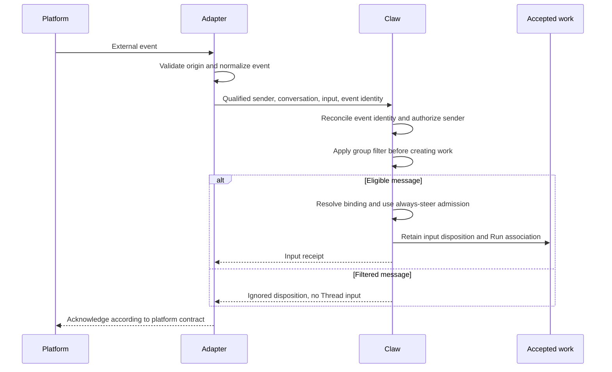

# Bridges and External Clients

## Design Position

A bridge is an embedded component of the single Claw server. It connects an external communication system to Claw's application model, normalizes platform events, and presents results without owning a second Thread store, scheduler, agent loop, or authorization policy. It invokes the shared application command boundary in-process; a separate bridge deployment, service credential, and private bridge-to-server transport are not required.

Lark, Discord, WhatsApp, and Telegram are supported design targets. Platform-specific capabilities, transports, account rules, and message formats belong to their adapters; they are not assumed to be identical or fixed by this contract. Adding another client must not require a new Run lifecycle.

## Boundaries

| Concern                                                                       | Owner                                      |
| ----------------------------------------------------------------------------- | ------------------------------------------ |
| Connect, authenticate with the platform, receive events, and send messages    | Platform adapter                           |
| Normalize conversation, sender, message, attachment, and interaction meaning  | Platform adapter under the bridge contract |
| Authorize senders and resolve conversation bindings                           | Claw bridge policy                         |
| Deduplicate accepted input and admit work                                     | Claw application                           |
| Execute, wait, cancel, and recover                                            | Claw execution and Harness                 |
| Select permitted recipients and retain delivery intent                        | Claw delivery policy                       |
| Convert output to supported platform representations and report send outcomes | Platform adapter                           |

Connection readiness, ingress admission, agent progress, and egress health are separately inspectable. An outbound send failure does not make a completed Run fail; a live connection does not mean an incoming message was accepted.

## Connections and Conversation Bindings

A connection identifies one configured platform account or installation. A Channel identifies one external conversation scope qualified by platform and connection; sender identities retain the same qualification. A room, direct chat, and reply thread can have different routing meaning; the adapter preserves those distinctions rather than flattening all events into one chat identifier.

A conversation binding routes a Channel directly to one Thread and declares allowed participants, group-message acceptance, and permitted reply destinations. Policy determines whether an unbound eligible Channel creates a new Thread, requires operator binding, or is rejected. None of those policies can route unknown input to an arbitrary existing conversation.

Independent external conversations are not merged merely because their participants have the same name or their text is similar. Binding several Channels to one Thread explicitly shares its history and private memory with visible disclosure implications. Separate Threads still share Global memory and the Instance workspace; [memory](09-memory.md) and [workspace](05-workspaces-and-environments.md) define those boundaries. It does not automatically subscribe every binding to every output.

Rebinding affects new events. Accepted work retains its origin and intended destination; delivery still checks current policy. Removing a binding or disabling a connection stops new admission according to policy, but does not imply cancellation of already accepted Runs. Pending replies whose destination is no longer authorized remain blocked or are explicitly discarded, never redirected silently.

## Group-Message Acceptance

Group-message acceptance is a connection setting with an optional conversation-binding override. Its effective value is visible when enabling a connection or binding. The two modes concern which messages enter the Thread, not whether accepted messages steer:

| Mode          | Eligible ordinary group messages                                   |
| ------------- | ------------------------------------------------------------------ |
| All messages  | Every otherwise authorized participant message                     |
| Mentions only | Only messages explicitly mentioning this connection's bot identity |

Direct messages do not require a group mention; sender authorization still applies. Adapters determine mentions from platform-provided identity metadata, not a substring matching the bot's display name. A reply, a quoted bot message, or a mention of someone else does not alone count. If the adapter cannot establish a mention, it cannot admit that group message in mentions-only mode; the limitation is visible rather than silently treating the mode as all messages.

Filtering happens before Thread creation, Thread input admission, attachment retention for execution, or model work. A filtered message does not enter the Thread as hidden context, trigger memory extraction, or return later through a previous-messages snapshot. The bridge retains minimal event identity and filter disposition for deduplication and diagnostics, not the rejected conversation body as agent context. Changing the setting affects new events, not already accepted input or replay of ignored group history.

Structured decision responses and authorized control actions use their own validation rather than requiring a textual mention. Mentions never grant permission or answer an approval. Echoes and service-originated output remain excluded in both modes.

## Ingress Flow

Transport acknowledgement is not a claim that an agent finished. An eligible event is not acknowledged as durably accepted until its retained disposition can be recovered. Repeated event delivery returns the prior disposition instead of creating another Run. A conflicting reuse of event identity is rejected.

Every ordinary message passing the filter follows [conversation message admission](03-execution-lifecycle.md#conversation-message-admission): idle starts work, queued or preparing work accumulates input, and running work receives steering. A bridge does not separately queue one Run per message or require a steering command. Waiting decisions and completion races follow the same contract as the console.

The bridge distinguishes ordinary messages from explicit controls and exact decision responses. Edited messages and redeliveries do not silently rewrite already accepted input. Gathering context cannot bypass the group filter: previous-message snapshots must exclude messages that were not admitted, and quoted content does not cause independent admission of the quoted event.

Attachments retain provenance and are subject to the same input and access requirements as API attachments. Missing essential content is reported; acceptance cannot pretend an inaccessible attachment was read.

## Decisions and Client Capabilities

Adapters describe which interaction forms they can represent: text, attachments, reply relationships, updates, and structured decisions. The bridge presents only actions supported by both the adapter and the caller's authority. No platform feature matrix or vendor-specific protocol is fixed here.

A decision response identifies the exact pending request, intended action, and external actor. Delivery of a button, card, or message is not approval. The backend validates the actor, current request, and decision preconditions; stale cards and duplicate callbacks cannot authorize another execution.

When a platform cannot safely express a request, the user receives an explicit limitation and, where permitted, a route to the console. Fallback text does not broaden authority or treat an ordinary message as approval.

## Egress and Reconciliation

A delivery names saved content, its originating work, and an authorized destination. Adapters report pending, confirmed, failed, or unknown send outcomes independently of agent completion. Where the platform supplies a usable delivery identity, retries reconcile it before sending again. Without such evidence, a possibly successful send remains uncertain rather than promising exactly-once delivery.

Delivery failures are retried or resolved using the saved result, not by re-executing the agent. Message splitting, editing, or formatting preserves the association to the original result and does not expose hidden reasoning, credentials, unrelated history, or unauthorized files. An adapter that only supports a final reply remains valid; streaming and message editing are optional presentation capabilities.

## Invariants

1. Platform identity, conversation routing, and Claw authority remain distinct.
2. A retried external event does not silently create duplicate work.
3. A transport or presentation failure never rewrites execution history.
4. A client with fewer interaction features cannot weaken approval or permission requirements.
5. Sharing a Thread across Channels is explicit; it never implies unrestricted output fan-out.
6. Group filtering precedes Thread admission; ignored messages cannot re-enter through context gathering or memory.
7. Accepted conversation messages use the shared always-steer path, independent of platform and group-filter mode.
