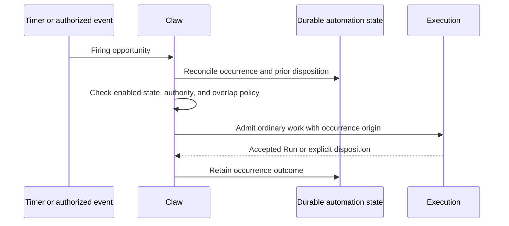

# Automation and Background Work

## Design Position

Claw includes unattended work in the same product scope as interactive conversation. Schedules, heartbeat, workflows, and autonomous follow-up create or control ordinary Claw work; none owns an alternate execution or persistence engine.

The product remains single-node. Durable intent does not promise execution at an exact wall-clock instant, continuous availability, distributed scheduling, or exactly-once external side effects.

## Automation Concepts

| Concept              | Responsibility                                                                                    |
| -------------------- | ------------------------------------------------------------------------------------------------- |
| Schedule             | A managed intent to request work at a time or recurrence, with an explicit target and policy      |
| Occurrence           | One identified firing opportunity, distinct from the Runs it may create                           |
| Heartbeat            | Periodic operational work within a declared scope and bounded purpose                             |
| Workflow             | An orchestration instance whose steps and dependencies progress from recorded work outcomes       |
| Autonomous follow-up | Bounded agent-directed continuation of a declared goal in response to permitted events or results |

An automation definition records who authorized it, what it may initiate, which context it uses, and where results may be delivered. Editing a definition affects later occurrences; already accepted Runs retain their captured configuration. An agent may manage automation only through explicitly granted Claw operations.

## Trigger-to-Work Flow

An occurrence is not considered successfully dispatched merely because a local timer fired. Repeated discovery of the same occurrence must resolve to the same accepted work or saved skip/rejection. Failure between accepting a Run and recording a notification cannot cause another Run to be accepted for the same occurrence.

Schedules have explicit time interpretation, missed-occurrence, and overlap policies. These choices are visible before enablement. A restart must not silently replay every elapsed interval or start a burst of overlapping work. Queued or skipped is not equivalent to completed, and disabling future occurrences does not cancel existing work unless that action is explicitly requested.

## Conversation and Working Context

Automation can target an existing Thread or create separate work according to its definition. It must not silently inject operational prompts into a user's conversation, bypass a waiting decision, or inherit unrestricted access from a shared workspace.

An occurrence directed to an existing Thread follows ordinary ordering. Explicit steering remains subject to the [active-input contract](03-execution-lifecycle.md#steering-and-cancellation). Work that requires independent progress uses another Thread instead of a second writer on the same history.

Heartbeat uses a declared operational purpose, selected knowledge, and bounded authority. Its periodic origin does not make workspace instructions trusted policy or grant new tools. Output is retained even when no human is watching; external notification is a separate delivery choice.

## Workflow Progress

A workflow owns orchestration progress; a Run owns execution progress. Each step identifies its input, dependencies, accepted work, and saved outcome. Downstream work advances only after the required durable outcome exists, not after submission or a suggestive stream message.

A waiting decision pauses the dependent portion of the workflow. Failure, cancellation, and recovery remain explicit at both levels. Retrying a step creates identifiable new work linked to the prior result; it does not erase the previous Run or automatically repeat a possibly applied external effect.

Cancelling a workflow stops new step admission and requests cancellation of active work according to its policy. It is not reported as fully stopped while required child outcomes remain unknown. Unrelated work and shared resources are not cancelled as a side effect.

## Autonomous Follow-Up

An autonomous goal has a declared scope, allowed triggers, stopping conditions, and resource limits. Input observations and child completion can justify new work only within that envelope. Exhausted limits, withdrawn authority, or an unanswered decision block further admission rather than authorizing escalation.

Feedback delivery does not recursively authorize unlimited work. Work initiated by another automated action retains that provenance and is subject to the same loop and admission policy as direct events. An agent cannot grant itself more authority by creating a schedule, workflow, or bridge binding.

## Invariants

1. Every automated Run has an accountable definition or triggering cause.
2. Repeated occurrence discovery and repeated result delivery do not create duplicate execution intent.
3. Definition edits and timer restarts do not rewrite accepted work.
4. Workflow progress follows saved outcomes, not observation timing.
5. Automation never bypasses Thread serialization, pending decisions, current permissions, or environment limits.
