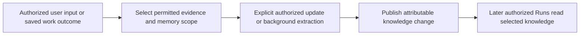

# Memory and Reusable Knowledge

## Design Position

Memory is intentionally retained knowledge for later work. It is distinct from message history, a complete Harness checkpoint, execution diagnostics, and ordinary workspace files. Claw owns which knowledge scope is selected and who may change it; Harness provides the execution-facing memory primitives.

This contract defines knowledge ownership and lifecycle without selecting a memory backend, directory layout, extraction algorithm, or search provider.

## Scope and Authority

A memory scope identifies the work context that owns its content and the readers and writers permitted to use it. A Session can select its own memory and explicitly shared knowledge; sharing is not inferred from matching participants, directory names, or bridge platforms.

Memory selection is part of [captured composition](02-configuration-and-composition.md). Content can evolve independently, so a Run records the knowledge references or versions needed to explain what it actually read. A configuration snapshot alone does not imply a snapshot of mutable knowledge.

Memory content is input, not execution policy. A stored instruction cannot enable tools, grant filesystem access, replace a Profile, or authorize a platform sender. Tool and scope permissions remain under Claw authority.

## Knowledge Update Flow

A direct edit and an agent-generated update identify their source and target scope. Conflicting edits cannot silently discard one another. Generated summaries or inferred facts remain distinguishable from user-authored instructions and confirmed facts where that distinction affects later use.

Background extraction and summarization are ordinary [automation](08-automation.md). They read permitted evidence and publish knowledge under their own work outcome. They do not mutate a completed conversation's history or turn live partial output into a complete checkpoint. Their failure does not retroactively fail the source Run.

## Lifecycle

Forking a Thread does not silently copy or share every selected memory scope. New work uses explicitly permitted selections. Changing a bridge connection or conversation binding does not move private knowledge into the new destination.

Archiving a Session, deleting its history, and deleting its memory are distinct operations. Removing shared knowledge requires checking its declared owner and remaining uses. Deleting memory does not retract copies already incorporated in retained Run history or an external message; retention must expose those boundaries honestly.

Knowledge unavailable at Run preparation is reported as such. Claw does not silently substitute another Session's memory or create an empty replacement under an existing identity.

## Invariants

1. Reusable knowledge cannot replace complete continuation or grant execution authority.
2. Sharing is explicit at the knowledge scope, not inferred from client routing.
3. Knowledge updates are attributable and do not rewrite completed work.
4. Memory failure and extraction failure have independent outcomes from the work that produced their evidence.
