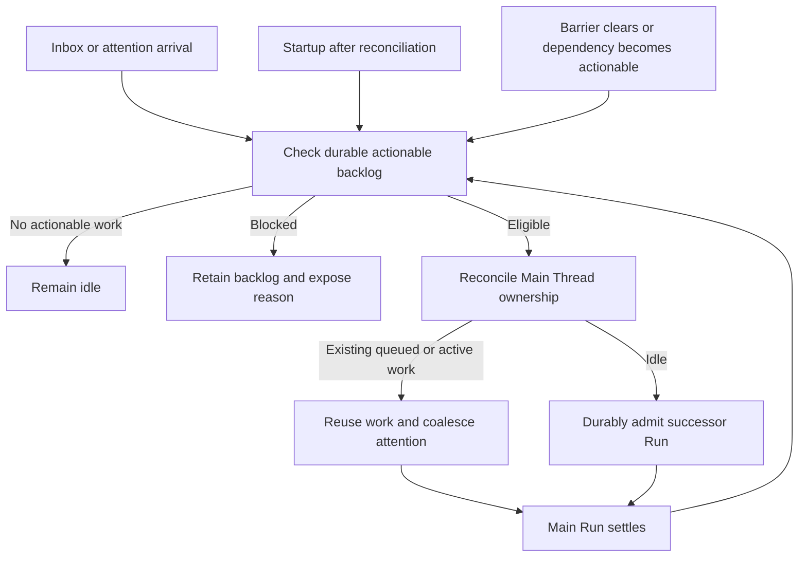

# One Thread Mode and Durable Attention

## Design Position

One Thread is an Instance conversation mode with one canonical Main Thread coordinating external conversations and persistent Worker Threads. It centralizes attention, not execution history: workers remain independently advancing Threads. Claw owns routing, durable attention, wake admission, collaboration authority, and external publication. Harness supplies execution and native Capability tools.

[Domain vocabulary](01-domain-model.md), [execution](03-execution-lifecycle.md), [recovery](04-persistence-and-recovery.md), and [bridge transport](07-bridges-and-clients.md) retain their shared ownership. This document owns the mode-specific coordination and Inbox contracts, not endpoint schemas, storage tables, or private callback implementations.

## Instance Mode and Lifetime

The Instance selects either per-Channel mode or One Thread mode at startup. The selection is exclusive across the Instance, not a mix configured separately for individual Channels. Per-Channel mode retains direct Channel-to-Thread conversation admission. One Thread mode routes eligible external conversation messages into the Main Thread's durable Inbox instead of inserting every message body into its prompt.

The Main Thread's identity and worker ownership survive Runs and process restarts. Mode changes need not migrate prior histories, bindings, or pending state: old-mode state may be explicitly discarded or left inactive. It must not silently become current-mode input, a delivery destination, or execution authority. No cross-mode history continuity is promised. Switching mode still requires orderly shutdown and settlement of active ownership; it cannot erase uncertain effects by reclassifying them as new work.

There is exactly one canonical Main Thread for the active One Thread mode. Ordinary create, fork, or archive operations cannot silently replace it or create a second coordinator. An explicit reset or removal makes affected retained state and work visible under the existing retention contract rather than silently retargeting it.

## Persistent Worker Collaboration

The Main Thread can create persistent Worker Threads for bounded work, inspect their saved state, and send further input across Runs. Creation retains ownership and the initial accepted work coherently; retrying the same request cannot create another worker. Workers are flat owned Threads, not Run-scoped child results and not recursive coordinators. Their independent lifetimes do not require a Main Run to remain open.

A native collaboration Capability exposes create, list, inspect, and send operations appropriate to the actual executing Thread:

| Caller        | Permitted collaboration scope                                                                        |
| ------------- | ---------------------------------------------------------------------------------------------------- |
| Main Thread   | Create workers; list and inspect itself and its owned workers; send work or replies to owned workers |
| Worker Thread | Inspect itself and its owning Main Thread; ask questions or report results to that owner             |

Workers cannot enumerate or message arbitrary siblings, adopt existing unrelated Threads, or create further persistent coordinators. A caller-supplied Thread identity or copied history cannot change the bound caller. Tool access is constrained by current application authority, not merely by role instructions. This model does not remove separately configured Harness subagents or [Run-scoped delegation](03-execution-lifecycle.md#delegation); those mechanisms do not confer persistent worker ownership.

A send uses ordinary durable input admission at the destination: it joins or steers eligible work, starts a Run when idle, and remains held or blocked at existing decision and recovery barriers. Worker-to-Main input cannot bypass Main's automatic-processing pause or other drain barriers; acceptance can precede eligible wake. The receipt proves acceptance, not that the recipient read, completed, or durably reported the task. Messages retain source Thread and request identity for reconciliation.

Worker completion, failure, cancellation, interruption, and requests for guidance create durable Main attention with references to saved state. Such attention can wake an idle Main Thread or notify its current Run; it does not merge worker history or imply success. The Main Thread checks saved outcomes before accepting a result. Notification and acknowledgement alone cannot retire an unresolved coordination obligation. These attention records use the Inbox's explicit processing dispositions and wake discipline without representing worker output as an external platform event. The Main Thread's bound collaboration Capability can list, inspect, and change their dispositions. Deferring attention preserves its dependency; settling reviewed attention stops further wakes for that obligation. Related notices retain their originating work references so reconciliation need not repeat an already accepted report or task.

Authorized users can inspect and directly converse with workers in the Console. Direct human input is admitted to that worker once and also records Main attention identifying the worker and accepted change. The Main Thread reconciles new work or changed instructions rather than duplicating the already admitted task. Human/API access remains governed by application grants, not the narrower model-facing collaboration catalog.

Stopping a Main Run does not prove workers stopped. Worker cancellation is explicit and reports actual outcomes. A worker's ordinary Console output is not external publication.

## Durable Inbox

After bridge authorization and group filtering, Claw durably retains each eligible external message with its qualified origin, Channel, sender, event identity, content, attachment availability, and applicable routing context. Duplicate delivery reconciles the original item; conflicting identity reuse is rejected. A durable Inbox receipt may precede any Run association. Transport acknowledgement does not require agent progress.

The Main Thread receives content-light attention notices and selectively reads Inbox items and permitted conversation context through a native Messaging Capability. A notice identifies available work, not a second copy of the external message to execute. Reading context cannot bypass bridge filtering, current authorization, or attachment access checks. The Main Thread can inspect pending work even if every live notice was lost.

The following are conceptual processing dispositions, not wire-format names:

| Disposition | Meaning and wake eligibility                                                                                                                       |
| ----------- | -------------------------------------------------------------------------------------------------------------------------------------------------- |
| Pending     | Requires Main attention now; remains drain-eligible even after notification, reading, or a Run's apparent success                                  |
| Deferred    | Explicitly waiting on an identified dependency, time, or human action; retains a reason and reactivation condition, not an immediate repeated wake |
| Handled     | Processing responsibility is explicitly settled with a recorded result or reference; external delivery may still be pending or uncertain           |
| Ignored     | Explicitly dismissed with a recorded reason under current policy; not silently inferred from inactivity                                            |

Only an authorized disposition change settles or defers processing. Receipt, notification delivery, context projection, reading, checkpoint publication, and terminal Run status do not imply that an Inbox item was handled. Concurrent disposition changes reconcile the state actually read; a stale update cannot erase a reactivation or newer work.

Deferring to worker work records the relevant dependency. Worker outcomes, including failure or interruption, reactivate the linked item for Main reassessment rather than leaving it indefinitely deferred. Deferral must also detect an already-satisfied dependency so a completion racing with the deferral is not lost. A deferred time or explicit human-resolution condition is durably rediscoverable after restart. Unrelated worker events do not reopen every deferred item. Handled and ignored items do not cause repeated inference unless explicitly reopened.

## Wake and Drain

Drain eligibility is a durable level condition: actionable pending Inbox items or unresolved Main attention exist. It is not a one-shot event, an unread flag, or a model claim that all work is finished. Claw checks that condition on message or attention arrival, startup after reconciliation, Main Run settlement, and when a pause, dependency, backoff, or recovery barrier is cleared. A Run-end hook can request the check but is not the only recovery mechanism.

Admission is serialized with Main Thread advancement ownership. Repeated checks coalesce with already queued or active work instead of creating a Run per item or per notification. The check and admission preserve the obligation until a durable disposition resolves it. A successful wake receipt does not discharge the backlog.

After a Main Run commits its terminal outcome, actionable pending items require eligible successor work even when no new event arrived and the agent declared completion. The old Run remains terminal and immutable; the successor uses the current Thread continuation and a newly captured composition. Existing queued work is reused where eligible. New arrivals racing with the final empty check cannot be stranded: either current work observes the retained attention or later dispatch rediscovers the pending condition. Restart after outcome commit but before the Run-end hook performs the same check without requiring platform redelivery.

Waiting decisions, disabled automatic processing, shutdown, revoked authority, uncertain input/effects, and recovery-required ownership block automatic advancement; drain does not bypass them. Pending work and the blocking reason remain visible. Pausing automatic processing is a durable control distinct from stopping one Main Run. A Run stop alone is not a lasting Inbox pause, but also is not permission to replay any interrupted action.

Failed or repeatedly non-progressing attempts retain the backlog and expose a diagnostic and controlled retry/backoff or an explicit recovery block. An automatic backoff has a durable next check; a required operator action is visible. Claw neither hot-loops model calls nor silently acknowledges or abandons pending items after an attempt cap. A safety limit can block processing visibly, not turn unfinished input into handled work. Known-safe attention retries do not replay unknown tool or send effects.

## Messaging and External Publication

The native Messaging Capability gives the Main Thread bounded operations to list Inbox work, read admitted messages and authorized context, change processing dispositions, send to an explicit permitted destination, and query saved delivery state. Claw owns those operations and their durable effects; adapters supply transport. No remote tool server is required merely to access this application functionality.

Only the Main Thread can authorize agent-originated external publication in One Thread mode. Workers return results to the owner; they have no external send authority or alternative integration credential/tool path that bypasses this boundary. The application checks the actual executing Thread and current destination policy when accepting a send and current delivery authority at dispatch. Captured configuration or a prompt claiming to be the Main Thread cannot grant publication rights. The trusted operator and separately granted broad host authority remain outside model-tool isolation guarantees.

A send records explicit content, source, request identity, and qualified destination under [egress and reconciliation](07-bridges-and-clients.md#egress-and-reconciliation). A Main final response is not automatically broadcast to any Channel. Sharing the Main Thread never subscribes every Channel to every answer, and worker output is not implicitly forwarded. Authorized exact-decision presentation follows the bridge interaction contract without granting workers an arbitrary send surface.

Delivery completion is independent of Inbox disposition and Run completion. A handled item can reference an unresolved delivery, which remains visible and reconciled from saved intent without rerunning the agent. Possibly successful sends remain unknown until evidence or explicit reconciliation resolves them; retries retain their original identity. There is no extra message-freshness hold, multi-bot arbitration, or model-selected delivery gate beyond explicit destination, current authority, and safe delivery reconciliation.

## Context, Memory, and Observation

One Thread mode deliberately shares the Main Thread's working context across participating Channels; it is suitable only where that shared context is authorized. Channel participation does not grant direct API access to all Main history, Inbox items, or other Channels. Selective retrieval and explicit egress do not promise isolation of knowledge already read into the Main Thread. Enabling bindings must make that disclosure boundary clear.

The Instance workspace and the Global plus Thread-private memory model remain unchanged. Main and workers each bind their own private scope; ownership does not mount a worker's private memory into the Main Thread. Explicit collaboration shares messages and authorized saved results, not memory scope identity. Internal memory-maintenance Threads are not workers and cannot be directly chatted with.

The Console exposes the canonical Main Thread, owned workers and direct worker conversations, Inbox dispositions and dependencies, delivery outcomes, and pause/block/retry state. Saved state remains authoritative after reconnect. A quiet stream, read notice, worker submission receipt, or successful Main Run must not be presented as an empty or fully processed Inbox.

## Invariants and Acceptance Scenarios

1. Restart with pending Inbox items and no live notifications admits eligible Main work without a new external event.
2. Main completion with unchanged pending items causes a successor Run; a crash before its hook cannot strand those items.
3. Concurrent arrival, completion, and repeated wake checks preserve every item without competing Main writers or duplicate wake work.
4. Reading or notifying does not settle processing; deferred items avoid busy loops and are reactivated by their recorded conditions, including already-completed dependencies.
5. Pause, pending decisions, shutdown, and recovery barriers retain visible backlog without unauthorized continuation or unknown-effect replay.
6. Worker ownership and human changes survive restarts; direct worker input is not redispatched by Main as a duplicate task.
7. A worker cannot publish externally by selecting a destination, impersonating Main, or obtaining a sibling's authority.
8. A successful Main Run, a handled Inbox item, and a confirmed external delivery remain independent facts.
